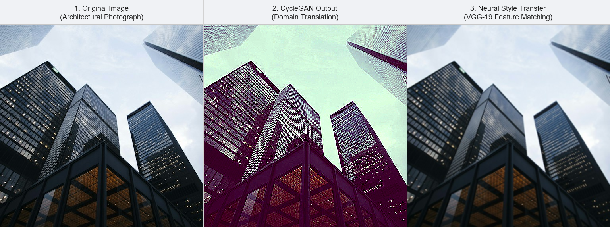

# Assignment 6: Applying AI-Based Style Transfer to an Image

## Objective
The objective of this assignment is to compare two different approaches to image style transfer:
1. **Method 1:** CycleGAN (domain-to-domain translation)
2. **Method 2:** Neural Style Transfer (VGG-based optimization)

## Selected Image
For this assignment, I picked a photograph of modern city skyscrapers (`original.jpg`). I chose this image because the straight architectural lines, window patterns, and open sky make it easy to evaluate how well each model keeps original details intact versus how strongly it applies the new style.

---

## Side-by-Side Comparison

Below is the side-by-side view showing the original photograph alongside the outputs from both methods:

*(Left: Original Image | Center: CycleGAN Output | Right: Neural Style Transfer Output)*

---

## Individual Outputs

### 1. Original Image

### 2. Method 1: CycleGAN Output

### 3. Method 2: Neural Style Transfer Output

---

## Written Comparison

- **Which method preserved the original content better?**  
  Neural Style Transfer (NST) preserved the original content much better. The edges of the buildings, window grids, and structural lines remain sharp and clearly recognizable. This happens because NST uses a content loss calculated from deep VGG feature layers, which directly penalizes structural changes.

- **Which method produced a stronger style transformation?**  
  CycleGAN produced a noticeably stronger style transformation. It altered the entire color scheme of the scene, turning the sky into a muted greenish tint and shifting the building tones to darker purples and browns. The overall look feels like a complete change in time of day and lighting rather than just a surface filter.

- **What differences did you notice between the outputs?**  
  The biggest difference is in how the style is applied. NST acts like a fine-tuning optimization on the image itself, giving it a subtle painterly tint while keeping all geometric boundaries intact. CycleGAN acts more like a domain translation model, changing the overall lighting, contrast, and color balance across the entire picture.

- **The Idea of Cycle Consistency in CycleGAN:**  
  CycleGAN is designed to work with unpaired images, meaning it doesn't have direct "before and after" training pairs. To prevent the generator from simply turning any input into a random stylish image (mode collapse), it relies on **cycle consistency**. The core idea is that translating an image from domain A to domain B, and then passing that result back through an inverse generator from domain B to domain A, should reconstruct the original image ($A \rightarrow B \rightarrow A \approx A$). This two-way check ensures that the model preserves the original building's shapes and composition while only transferring the style characteristics.